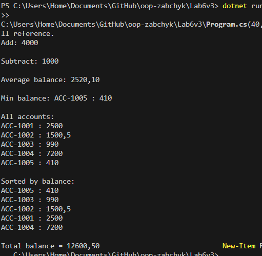

# Lab6 — Lambda & Delegates (Variant 3)

Короткий опис лабораторної №6.

## Мета

* Використати делегати, анонімні методи та лямбда-вирази.
* Попрактикуватися з Func, Action, Predicate.
* Застосувати LINQ до колекцій.

## Варіант 3: BankAccount

Клас **BankAccount** містить:

* `Number` — номер рахунку
* `Balance` — баланс

## Що реалізовано

* **Власний делегат** `AccountOperation` (додавання, віднімання).
* **Анонімний метод** (віднімання).
* **Лямбда-вираз** (додавання).
* **Func** — середній баланс.
* **Action** — форматований вивід.
* **LINQ**: `Average`, `MinBy`, `OrderBy`, `Aggregate`.

## Запуск

dotnet run

## Коміт
Lab6: Lambda & Delegates

## Скрін

