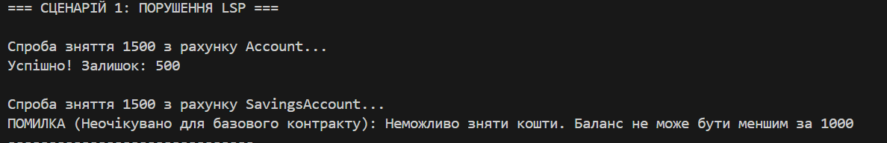
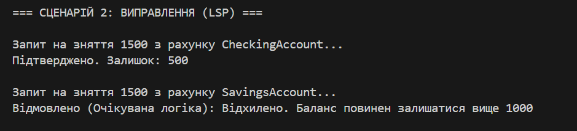

# Звіт до лабораторної роботи №22

## 1. Опис проблеми (Як ми порушили правила)

**Початкова ситуація:**
Ми створили два класи:

1. `Account` (звичайний рахунок) — дозволяє знімати гроші, якщо вони просто є на балансі.
2. `SavingsAccount` (ощадний рахунок) — ми зробили його "дитиною" (спадкоємцем) звичайного рахунку. Але додали умову: не можна знімати гроші, якщо на рахунку залишиться менше 1000 гривень.

**Чому це погано (Порушення LSP):**
Принцип підстановки Лісков каже: "Якщо ти використовуєш батьківський клас, то маєш без проблем використовувати і дочірній, навіть не знаючи про це".

У нас це правило порушилося.

* Коли програма бачить тип `Account`, вона думає: "Є 2000 грн, значить можу зняти 1500".
* Але коли ми підставили `SavingsAccount`, програма раптово видала помилку, бо там стоїть прихована заборона (ліміт 1000).
* **Результат:** Дочірній клас виявився суворішим за батьківський, і це зламало логіку програми.

**Фрагмент коду з помилкою:**

```csharp

public virtual void Withdraw(decimal amount) { ... } 

public override void Withdraw(decimal amount)
{
    if (Balance - amount < 1000) throw new Exception(...); 
    base.Withdraw(amount);
}

```


## 2. Як ми це виправили (Рішення)

**Що ми зробили:**
Ми відмовилися від ідеї, що "Ощадний рахунок" — це різновид "Звичайного рахунку". Замість цього ми зробили їх "братами".
Ми створили головний абстрактний клас `BankAccount` (Банківський Рахунок).

**Нова структура:**

1. `BankAccount` (Головний) — просто каже, що функція "Зняти гроші" існує.
2. `CheckingAccount` (Звичайний) — реалізує прості правила (гроші є = знімаємо).
3. `SavingsAccount` (Ощадний) — реалізує суворі правила (ліміт 1000).

**Чому це правильно:**
Тепер головний клас нічого не обіцяє заздалегідь. Програма знає, що різні рахунки можуть мати різні правила. Коли `SavingsAccount` забороняє зняття — це нормально, бо він більше не прикидається "вседозволеним" звичайним рахунком.

**Фрагмент виправленого коду:**

```csharp

public abstract void Withdraw(decimal amount);

public class CheckingAccount : BankAccount { ... }
public class SavingsAccount : BankAccount { ... }

```


## 3. Висновки

Виконуючи цю роботу, я зрозумів просту річ про наслідування та принцип LSP:

1. **Не можна обманювати очікування.** Якщо батьківський клас дозволяє щось робити, то клас-спадкоємець не має права це забороняти.
2. **Спадкування — це не завжди добре.** Якщо треба змінити правила гри (як у нас із лімітом), краще не наслідуватись напряму, а створити спільний абстрактний клас.
3. **Результат:** Виправлена програма працює стабільно. Вона готова до того, що транзакцію можуть відхилити, і не "падає" з помилкою, як це було на початку.


